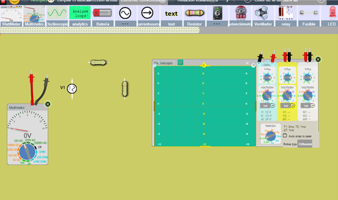
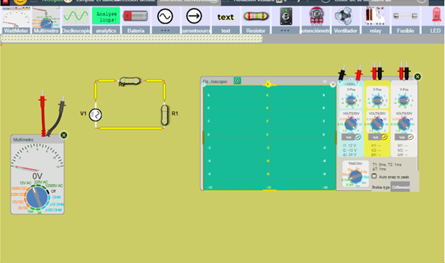
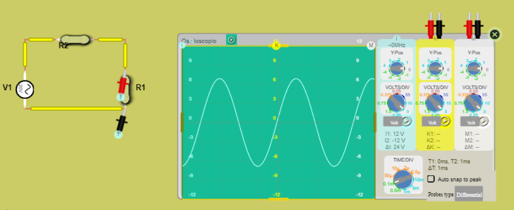
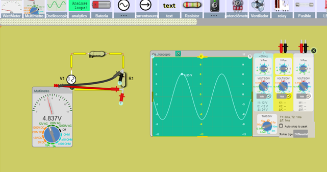

# PRACTICA-No.-6-CARACTERISTICAS-DE-LA-ONDA-SENOIDAL
# Informe 

1. OBJETIVOS 

1.1. OBJETIVO GENERAL

 1.2. OBJETIVO ESPECIFICO

2. MARCO TEORICO

3. DIAGRAMAS

Ahora haremos la simulacion del circuito en DCAClab

Seleccionamos los materiales a utilizar

Armamos el circuito como esta en el esquema

Conectamos el osciloscopio a la resitensia R

Conectamos el multimetro

4. LISTA DE COMPONENTES

| CANTIDAD|MATERIAL O EQUIPO|
| ----- | ---- |
|1|Generador de funciones|
|1|Osciloscopio|
|1|Multimetro digital |
|1|Resistor de 1kΩ|
|1|Resistor de 2.2kΩ|
|1|Protoboard|
Para este laboratorio utilizaremos el simulador DCAClab
5. EXPLICACION 

- Abrimos el simulador de DCAClab
- Seleccionamos los materiales antes mencionados 
- Armamos el circuito como esta en la figura 7.1 (conectamos las 2 resistencias en serie)
- Modificamos la fuente de corriente alterna para que tenga una seña de 20 Vpp y una frecuen de 2.5kHz
-  Conectamos las terminales del osciloscopio  a la resistencia R_L y de igual manera al multimetro
5.1. Responda las siguientes preguntas

1) ¿Cuantas divisines por cuadro abarca la amplitud pico de la señal de salida? 

2) ¿En que valor esta posicinada la perilla VOLTS/DIV?
Se encuentra en el valor de 3
3) ¿Cuantas divisiones por cuadro abarca un ciclo completo de la señal de salida?

4) ¿En que valor esta posicionada la perilla TIME/DIV?
Se encuentra en 0.1m
5) ¿Cual es la amplitud de voltaje y el periodo de la sela que aparece en la pantalla del osciloscopio?
  Amplitud de voltaje : 6.85 V
  Periodo: 0,0004 s
6)Determine la frecuencia natural (Hz) y la frecuencia angular (rad/s) de la señal de salida

7) Con el multimetro digital mida el voltaje de salida en RL
El voltaje de salida nos da 4.83 V
8) Compare el voltaje medido en el punto 5 y el obtenido en el punto 7.
¿Coinciden? ¿Porque?
Sus voltajes  son diferentes, el primero es de 6,85V y el otro de 4,84V esto de sebe a que el primero es el valor pico y el otro es su valor rms

6. CONCLUCION

7. BIBLIOGRAFIA

- Sadiku. (sf). Teoremas de circuitos. En Sadiku, Fundamentos de Circuitos Eléctricos

- Floyd, T. (2007). PRINCIPIOS DE CIRCUITOS ELÉCTRICOS. (8va ed.). México, México: Pearson Education.
